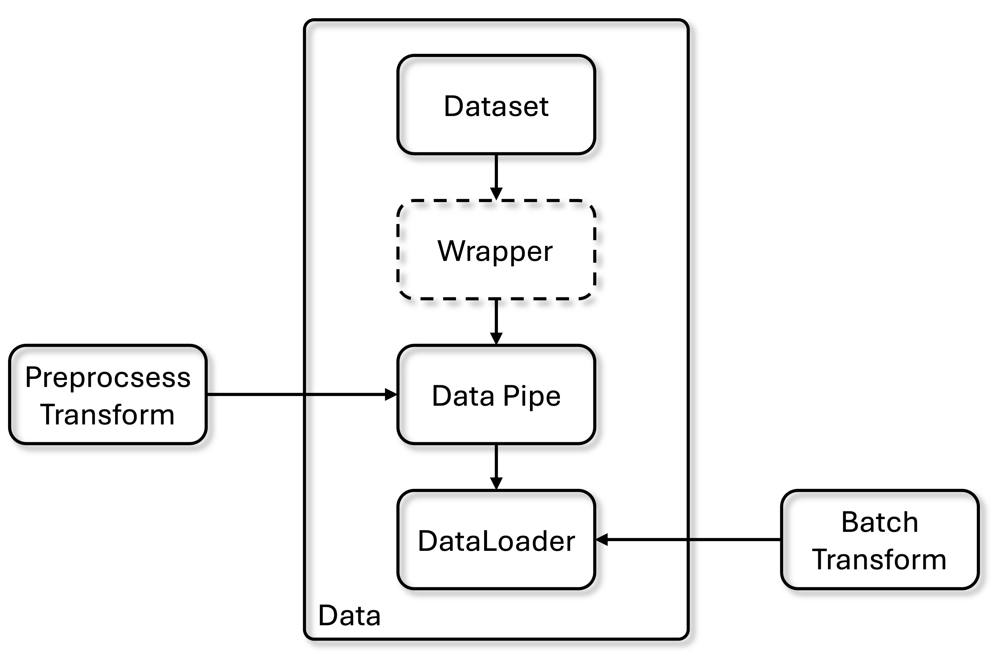

# Data

The overall data pipeline of Vis4D.

<p align="center">
    <!-- pypi-strip -->
    <picture>
    <!-- /pypi-strip -->
    
    <!-- pypi-strip -->
    </picture>
    <!-- /pypi-strip -->
</p>

The data flow starts from PyTorch dataset to `DataPipe` to add the preprocess transform (only apply to single sample).
And in the `DataLoader`, the samples will be collated to batch and add batch transform (apply to whole batch of data).
Finally, the processed batch of data will be fed into Trainer through `Data Connector`.

The following is the modules of Vis4D data.

```bash
--root
    --vis4d
        --data
            --datasets
            --io
            --transforms
            --const.py
            --data_pipe.py
            --loader.py
            ...
```

- `datasets` : All PyTorch datasets are implemented here.
- `io` : Supported data backends.
- `transforms` : Supported data augmentation.
- `const.py`: Defines data related constants.
- `data_pipe.py` : Date Pipe.
- `loader.py` : Data loader. implementation.

## Datasets

We implement a typed version of the PyTorch datasets.
In addition, we provide a number of Mixin classes which a dataset can inherit from to implement additional functionality.

### Data Constants

All the data is propagated as a python dictionary in our pipeline.
We define a common set of keys where we expect a pre-defined format to enable the usage of common data pre-processing operations among different datasets.

Check more details [here](https://github.com/SysCV/vis4d/tree/main/vis4d/data/const.py)

### Data Backend

All datasets use the `DataBackend` to access data.

By default, we use `FileBackend` which loads data from and saves data to the local hard drive.

For training on cluster, we recommand using `HDF5Backend`.

For more details, please check [here](https://github.com/SysCV/vis4d/tree/main/vis4d/data/io/hdf5.py)

And use this [script](https://github.com/SysCV/vis4d/tree/main/vis4d/data/io/to_hdf5.py) to generate hdf5 data.

### Dataset

Here we use [`COCO`](https://github.com/SysCV/vis4d/tree/main/vis4d/data/datasets/coco.py) as example.

```python
class COCO(CacheMappingMixin, Dataset):
    """COCO dataset class."""
    def __init__(
        self,
        data_root: str,
        keys_to_load: Sequence[str] = (
            K.images,
            K.boxes2d,
            K.boxes2d_classes,
            K.instance_masks,
        ),
        split: str = "train2017",
        remove_empty: bool = False,
        use_pascal_voc_cats: bool = False,
        cache_as_binary: bool = False,
        cached_file_path: str | None = None,
        **kwargs: ArgsType,
    ) -> None:
        """Initialize the COCO dataset.

        Args:
            data_root (str): Path to the root directory of the dataset.
            keys_to_load (tuple[str, ...]): Keys to load from the dataset.
            split (split): Which split to load. Default: "train2017".
            remove_empty (bool): Whether to remove images with no annotations.
            use_pascal_voc_cats (bool): Whether to use Pascal VOC categories.
            cache_as_binary (bool): Whether to cache the dataset as binary.
                Default: False.
            cached_file_path (str | None): Path to a cached file. If cached
                file exist then it will load it instead of generating the data
                mapping. Default: None.
        """
        super().__init__(**kwargs)

        self.data_root = data_root
        self.keys_to_load = keys_to_load
        self.split = split
        self.remove_empty = remove_empty
        self.use_pascal_voc_cats = use_pascal_voc_cats

        # handling keys to load
        self.validate_keys(keys_to_load)

        self.load_annotations = (
            K.boxes2d in keys_to_load
            or K.boxes2d_classes in keys_to_load
            or K.instance_masks in keys_to_load
            or K.seg_masks in keys_to_load
        )

        self.data, _ = self._load_mapping(
            self._generate_data_mapping,
            self._filter_data,
            cache_as_binary=cache_as_binary,
            cached_file_path=cached_file_path,
        )

        if self.use_pascal_voc_cats:
            self.category_names = get_category_names(coco_seg_map)
        else:
            self.category_names = get_category_names(coco_det_map)
```

The core concept is `self._generate_data_mapping` function to convert the annotation file to the data sample that can be load for each iteration.

In our provided `CacheMappingMixin`, we allow user to cache the data samples into `pkl` file so the next time the data can be directly used.

For more details, please check [here](https://github.com/SysCV/vis4d/tree/main/vis4d/data/datasets/util.py)

```python
    def __getitem__(self, idx: int) -> DictData:
        """Transform coco sample to vis4d input format.

        Returns:
            DataDict[DataKeys, Union[torch.Tensor, Dict[Any]]]
        """
        data = self.data[idx]
        img_h, img_w = data["img"]["height"], data["img"]["width"]

        dict_data: DictData = {}

        ...

        return dict_data
```

After setting the other properties for the dataset, in the `__getitem__` function, we return the data dictionary according to your own need.

Remember to check the data constants to set the keys of data dict properly.

### VideoDataset

For `VideoDataset`, we use [NuScenes](https://github.com/SysCV/vis4d/tree/main/vis4d/data/datasets/nuscenes.py) as the example.

The core difference is `self.video_mapping`. 

```python
    self.video_mapping = self._generate_video_mapping()

    ...

    def _generate_video_mapping(self) -> VideoMapping:
        """Group dataset sample indices by their associated video ID.

        The sample index is an integer while video IDs are string.

        Returns:
            VideoMapping: Mapping of video IDs to sample indices and frame IDs.
        """
        video_to_indices: dict[str, list[int]] = defaultdict(list)
        video_to_frame_ids: dict[str, list[int]] = defaultdict(list)
        for i, sample in enumerate(self.samples):  # type: ignore
            seq = sample["scene_name"]
            video_to_indices[seq].append(i)
            video_to_frame_ids[seq].append(sample["frame_ids"])

        return self._sort_video_mapping(
            {
                "video_to_indices": video_to_indices,
                "video_to_frame_ids": video_to_frame_ids,
            }
        )
```

The `self.video_mapping` provides `video_to_indices` and `video_to_frame_ids` for video training and inference.

### Multi-sensor dataset

If the dataset contains multiple sensors, e.g. multiple cameras, LiDAR, RADAR, ..., etc, the keys of the returned data dict will be the **sensor name** and then the key will be the normal data dict.

Thus, the data connector will also need to be changed.

Please check more details [here](./connector.md).

Please check [datasets folder](https://github.com/SysCV/vis4d/tree/main/vis4d/data/datasets) to see all supported datasets.

## Dataser Wrapper

Some works need special dataset wrapper to further prepare the dataset.

Please check each of them from each model zoo config.

## Transform

In Vis4D, we design the `Transform` decorator to stores which `in_keys` are input to a transformation function and which `out_keys` are overwritten in the data dictionary by the output of this transformation.

Nested keys in the data dictionary can be accessed via key.subkey1.subkey2.
If any of `in_keys` is 'data', the full data dictionary will be forwarded to the transformation.
If the only entry in `out_keys` is 'data', the full data dictionary will be updated with the return value of the transformation.

For the case of multi-sensor data, the sensors that the transform should be applied can be set via the 'sensors' attribute. By default, we assume a transformation is applied to all sensors.

This class will add a 'apply_to_data' method to a given Functor which is used to call it on a DictData object. NOTE: This is an issue for static checking and is not recognized by pylint. It will usually be called in the compose() function and will not be called directly.

```python
@Transform(in_keys="images", out_keys="images")
class MyTransform:
    def __call__(images: list[np.array]) -> list[np.array]:
        images = do_something(images)
        return images

my_transform = MyTransform()
data = my_transform.apply_to_data(data)
```

Note that all transform functions take `List` of data as input.
This design allow us to use the transform for both single data sample (`preprocess_fn`) and a batch of data (`batch_transform`).

Please check more details [here](https://github.com/SysCV/vis4d/tree/main/vis4d/data/transforms/)

## Data Pipe

We use the `Datapie` to wraps one or multiple instances of a PyTorch Dataset so that the preprocessing steps can be shared across those datasets.

In general a data pipe is the `ConcatDataset`, which allows to composes the datasets that sharing the preprocessing pipeline.

Please check more details [here](https://github.com/SysCV/vis4d/tree/main/vis4d/data/data_pipe.py)

## Data Loader

The final part of the data is `DataLoader`.

We provide `build_train_dataloader` and `build_inference_dataloaders` functions to help construct the data loader given different batch size and numbers of workers for the given datasets.

The design of collact function will help collect the batch of data and then apply `batch_transform` to apply the same transform across batch.

`samples_per_gpu` means how many samples per gpu, and `workers_per_gpu` mean how many worker per gpu will use for data loader.

The total effective batch size will be: `samples_per_gpu` x `num_gpus` x `num_nodes` x `accumulate_grad_batches`.

Note that it will automatically use distributed data parallel (DDP) for multi-gpu training.

Please check more details [here](https://github.com/SysCV/vis4d/tree/main/vis4d/data/loader.py)

## Config

Now you understand the design of our data module.
Then you can walk through how we construct the data config in the following example.

- Construct data config with `train_dataloader` and `test_dataloader`.

```python
def get_coco_detection_cfg(
    data_root: str = "data/coco",
    train_split: str = "train2017",
    train_keys_to_load: Sequence[str] = (
        K.images,
        K.boxes2d,
        K.boxes2d_classes,
    ),
    train_cached_file_path: str | None = "data/coco/train.pkl",
    test_split: str = "val2017",
    test_keys_to_load: Sequence[str] = (
        K.images,
        K.original_images,
        K.boxes2d,
        K.boxes2d_classes,
    ),
    test_cached_file_path: str | None = "data/coco/val.pkl",
    cache_as_binary: bool = True,
    data_backend: None | ConfigDict = None,
    image_size: tuple[int, int] = (800, 1333),
    samples_per_gpu: int = 2,
    workers_per_gpu: int = 2,
) -> DataConfig:
    """Get the default config for COCO detection."""
    data = DataConfig()

    data.train_dataloader = get_train_dataloader(
        data_root=data_root,
        split=train_split,
        keys_to_load=train_keys_to_load,
        data_backend=data_backend,
        image_size=image_size,
        samples_per_gpu=samples_per_gpu,
        workers_per_gpu=workers_per_gpu,
        cache_as_binary=cache_as_binary,
        cached_file_path=train_cached_file_path,
    )

    data.test_dataloader = get_test_dataloader(
        data_root=data_root,
        split=test_split,
        keys_to_load=test_keys_to_load,
        data_backend=data_backend,
        image_size=image_size,
        samples_per_gpu=1,
        workers_per_gpu=workers_per_gpu,
        cache_as_binary=cache_as_binary,
        cached_file_path=test_cached_file_path,
    )

    return data
```

- Build `train_dataloader` with `COCO` dataset, define `preprocess_fn`, define `batch_process`, and wrap everything into `DataPipe` and `Dataloader`.

```python
def get_train_dataloader(
    data_root: str,
    split: str,
    keys_to_load: Sequence[str],
    data_backend: None | DataBackend,
    image_size: tuple[int, int],
    samples_per_gpu: int,
    workers_per_gpu: int,
    cache_as_binary: bool,
    cached_file_path: str | None = None,
) -> ConfigDict:
    """Get the default train dataloader for COCO detection."""
    # Train Dataset
    train_dataset_cfg = class_config(
        COCO,
        keys_to_load=keys_to_load,
        data_root=data_root,
        split=split,
        remove_empty=True,
        data_backend=data_backend,
        cache_as_binary=cache_as_binary,
        cached_file_path=cached_file_path,
    )

    # Train Preprocessing
    preprocess_transforms = [
        class_config(
            GenResizeParameters,
            shape=image_size,
            keep_ratio=True,
            align_long_edge=True,
        ),
        class_config(ResizeImages),
        class_config(ResizeBoxes2D),
    ]

    if K.instance_masks in keys_to_load:
        preprocess_transforms.append(class_config(ResizeInstanceMasks))

    flip_transforms = [class_config(FlipImages), class_config(FlipBoxes2D)]

    if K.instance_masks in keys_to_load:
        flip_transforms.append(class_config(FlipInstanceMasks))

    preprocess_transforms.append(
        class_config(
            RandomApply,
            transforms=flip_transforms,
            probability=0.5,
        )
    )

    preprocess_transforms.append(class_config(NormalizeImages))

    train_preprocess_cfg = class_config(
        compose,
        transforms=preprocess_transforms,
    )

    train_batchprocess_cfg = class_config(
        compose,
        transforms=[
            class_config(PadImages),
            class_config(ToTensor),
        ],
    )

    return get_train_dataloader_cfg(
        datasets_cfg=class_config(
            DataPipe,
            datasets=train_dataset_cfg,
            preprocess_fn=train_preprocess_cfg,
        ),
        batchprocess_cfg=train_batchprocess_cfg,
        samples_per_gpu=samples_per_gpu,
        workers_per_gpu=workers_per_gpu,
    )
```

- Build `test_dataloader` with `COCO` dataset, define `preprocess_fn`, define `batch_process`, and wrap everything into `DataPipe` and `Dataloader`.

```python
def get_test_dataloader(
    data_root: str,
    split: str,
    keys_to_load: Sequence[str],
    data_backend: None | DataBackend,
    image_size: tuple[int, int],
    samples_per_gpu: int,
    workers_per_gpu: int,
    cache_as_binary: bool,
    cached_file_path: str | None = None,
) -> ConfigDict:
    """Get the default test dataloader for COCO detection."""
    # Test Dataset
    test_dataset = class_config(
        COCO,
        keys_to_load=keys_to_load,
        data_root=data_root,
        split=split,
        data_backend=data_backend,
        cache_as_binary=cache_as_binary,
        cached_file_path=cached_file_path,
    )

    # Test Preprocessing
    preprocess_transforms = [
        class_config(
            GenResizeParameters,
            shape=image_size,
            keep_ratio=True,
            align_long_edge=True,
        ),
        class_config(ResizeImages),
        class_config(ResizeBoxes2D),
    ]

    preprocess_transforms.append(class_config(NormalizeImages))

    test_preprocess_cfg = class_config(
        compose,
        transforms=preprocess_transforms,
    )

    test_batchprocess_cfg = class_config(
        compose,
        transforms=[
            class_config(PadImages),
            class_config(ToTensor),
        ],
    )

    # Test Dataset Config
    test_dataset_cfg = class_config(
        DataPipe,
        datasets=test_dataset,
        preprocess_fn=test_preprocess_cfg,
    )

    return get_inference_dataloaders_cfg(
        datasets_cfg=test_dataset_cfg,
        batchprocess_cfg=test_batchprocess_cfg,
        samples_per_gpu=samples_per_gpu,
        workers_per_gpu=workers_per_gpu,
    )
```
