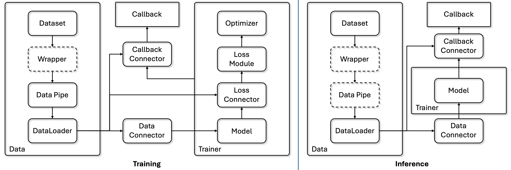

# Getting started

We provide a command line interface for training and evaluating your models.

Assuming you have installed the package using pip, you can use the command `vis4d` to access the CLI.
Alternatively, you can run the CLI using `python -m vis4d.engine.run`.
It might be useful to use the engine together with `torchrun`, ..., etc.

The CLI relies on a configuration file to specify each experiment. We use [ml_collections](https://github.com/google/ml_collections) as underlying framework to define the configuration files.

## Overview

The overall design of Vis4D can be dvidied into **Training (fit)** and **Inference (test)**.

<p align="center">
    <!-- pypi-strip -->
    <picture>
    <!-- /pypi-strip -->
    
    <!-- pypi-strip -->
    </picture>
    <!-- /pypi-strip -->
</p>

We use [PyTorch Lightning](https://lightning.ai/docs/pytorch/latest/) as the `Trainer` and use the design of `Connector` to connect data, model, loss, and callbacks.

## Data and Output Directories

You can use the library in different folder structures and codebase.

By default, Vis4D will use the following directories for datasets used in the experiments:

```bash
--root
    --data
        --dataset1
        --dataset2
```

You can change the data root according to your need in the config.
Check more details in the [Data](../dev_guide/data.md) section.

Vis4D will dump the output, e.g. model weights, evaluation and visualization results, log, ..., etc, to the `output_dir`.
This output folder is decided by your `config.experiment_name` and `config.version`, and `config.work_dir` ("vis4d-workspace" as default).

The default output folder structure is:

```bash
--root
    --vis4d-workspace
        --experiment_name1
            --version1
            --version2
        --experiment_name2
            --version1
            --version2
```

## Interface

The provided examples assume that the experiment configuration file is located at `path_to_experiment_cfg.py`.

```bash
vis4d [fit | test] --config path_to_experiment_cfg.py
                   --ckpt: Checkpoint path
                   --gpus: Number of GPUs per node
                   --nodes: Number of nodes
                   --print-config: If set, prints the configuration to the console
                   --resume: Resume training
                   --vis: If set, running visualization using visualizer callback
                   --wandb: If set, use Weights & Biases logging
```

Using `fit` to train the model and `test` to test the model.

For more details about our config system please check [Config System](./config.md).

## Flags

The followings are the flags to be used for CLI. You can find how the engine uses these flags [here](https://github.com/SysCV/vis4d/blob/main/vis4d/engine/run.py).

### `--config`

Path to config file [.py |.yaml].

### `--ckpt`

Checkpoint path.

Can be used for testing, model pre-trained weights, or for resume training.

### `--gpus`

Number of GPUs per node to use.

Default value is 0 which will use CPU for training and testing. For more than `2` GPUs, our trainer will use [Distributed Data Parallel (DDP)](https://docs.pytorch.org/tutorials/intermediate/ddp_tutorial.html) for multi-gpu training and testing.

### `--nodes`

Numbers of nodes to use.

Default value is 1. If you want to use multi-node training, please configure the multi-node scripts according to your own system.

Example shell script for using `sbatch` with `vis4d`:
```bash
#!/bin/bash
#SBATCH --job-name=Vis4D
#SBATCH --time=02:00:00
#SBATCH --nodes=2
#SBATCH --ntasks-per-node=4
#SBATCH --gpus-per-node=4
#SBATCH --output=log/%j.out

srun vis4d fit --config path_to_experiment_cfg.py --gpus 4 --nodes 2
```

### `--print-config`

The conifg used for the experiment (for both `fit` and `test`) will be dumped as yaml file under the output folder. Set this flag will also print the configuration to the console so you don't have to check the dumped yaml file.

### `--resume`

Resume model training.

There are two resuming mechanism.

- If the `ckpt` flag is set, then the trainer will restore the training stage from the provided checkpoint.

```bash
vis4d fit --config path_to_experiment_cfg.py --ckpt test.ckpt --resume
```

- If the `ckpt` is not set, then the trainer will try to restore the training stage from the latest checkpoint from the output folder. Which means you need to make sure your experiment name and version are set to the model you want to resume training and the `last.ckpt` is stored under `checkpoints` folder under the specified output folder.

```bash
vis4d fit --config path_to_experiment_cfg.py --config.experiment_name exp_1 --config.version first_trial --resume
```

### `--vis`

If set, running visualization using visualizer callback.

Since some visualization is only for dumping results or debugging, so by default without this flag, the engine won't trigger the visualization callback.

### `--wandb`

[Weights & Biases](https://wandb.ai/site/) is the powerful for logging the training and recording the experiments. If set this flag, then the engine will use it as the logger.

Make sure to install `wandb` first and log in to the desired account.

## Overwrite Config Parameters

We support overwriting config parameters via the CLI.

Assuming you have a config parameter `params.lr` in your config file, you can overwrite it using the following command:

```bash
vis4d fit --config path_to_experiment_cfg.py --config.params.lr=0.01
```

Note that when misstyping a config parameter:

```bash
vis4d fit --config path_to_experiment_cfg.py --config.params.lrs=0.01
```

It will result in the following error:

```bash
AttributeError: Did you mean "lr" instead of "lrs"?
```

Check [here](./cli.ipynb) for CLI demo.

## Python API

You can also enjoy vis4d python api directly and compose your own application using the functor we provide.

Check [here](./api.ipynb) for API demo.
