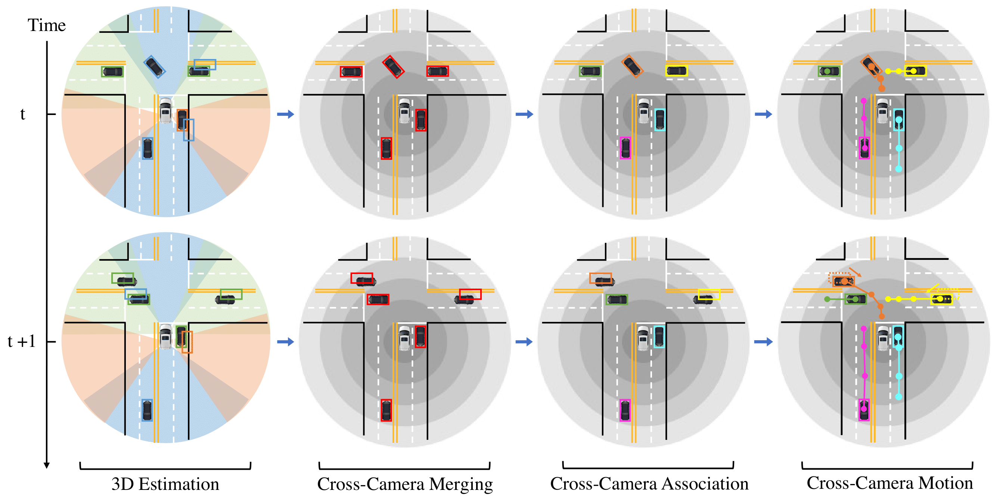

# [CoRL2022] CC-3DT: Panoramic 3D Object Tracking via Cross-Camera Fusion
This is the official implementation of our paper **"CC-3DT: Panoramic 3D Object Tracking via Cross-Camera Fusion"**.

[Tobias Fischer*](https://tobiasfshr.github.io/), [Yung-Hsu Yang*](https://royyang0714.github.io/), [Suryansh Kumar](https://suryanshkumar.github.io/), [Min Sun](https://aliensunmin.github.io/), [Fisher Yu](https://www.yf.io/)

[[Paper](https://arxiv.org/abs/2212.01247)] [[Project](https://www.vis.xyz/pub/cc-3dt/)] [[Video](https://www.youtube.com/watch?v=CbozK3LmtHQ)]



## Abstract
To track the 3D locations and trajectories of the other traffic participants at any given time, modern autonomous vehicles are equipped with multiple cameras that cover the vehicle’s full surroundings. Yet, camera-based 3D object tracking methods prioritize optimizing the single-camera setup and resort to post-hoc fusion in a multi-camera setup. In this paper, we propose a method for panoramic 3D object tracking, called CC-3DT, that associates and models object trajectories both temporally and across views, and improves the overall tracking consistency. In particular, our method fuses 3D detections from multiple cameras before association, reducing identity switches significantly and improving motion modeling. Our experiments on large-scale driving datasets show that fusion before association leads to a large margin of improvement over post-hoc fusion. We set a new state-of-the-art with 12.6% improvement in average multi-object tracking accuracy (AMOTA) among all camera-based methods on the competitive NuScenes 3D tracking benchmark, outperforming previously published methods by 6.5% in AMOTA with the same 3D detector.

## Model Zoo
### CC-3DT with QD-3DT detector
| Backbone | Motion Model | Lr schd | NDS-val | AMOTA-val | Config | Weights | Preds | Visuals |
| :------: | :----------: | :-----: | :-----: | :-------: | :----: | :-----: | :---: | :-----: |
| R-50-FPN | KF3D | 1x | 0.3460 | 0.218 | [config](./cc_3dt_frcnn_r50_fpn_kf3d_12e_nusc.py) | [tracking model](https://dl.cv.ethz.ch/vis4d/cc_3dt/cc_3dt_frcnn_r50_fpn_12e_nusc_d98509.pt) | [preds]() | [visuals]() |
| R-101-FPN | KF3D | 2x | 0.3790 | 0.302 | [config](./cc_3dt_frcnn_r101_fpn_kf3d_24e_nusc.py) | [tracking model](https://dl.cv.ethz.ch/vis4d/cc_3dt/cc_3dt_frcnn_r101_fpn_24e_nusc_f24f84.pt) | [preds]() | [visuals]() |
| R-101-FPN | VeloLSTM | 2x | 0.3914 | 0.311 | [config](./cc_3dt_frcnn_r101_fpn_velo_lstm_24e_nusc.py) | [motion model](https://dl.cv.ethz.ch/vis4d/cc_3dt/velo_lstm_cc_3dt_frcnn_r101_fpn_100e_nusc_9526a7.pt) | [preds]() | [visuals]() |

## Getting Started
### Train the Tracking Model
```bash
# R50
python -m vis4d.pl fit --config vis4d/zoo/cc_3dt/cc_3dt_frcnn_r50_fpn_kf3d_12e_nusc.py --gpus 8

# R101
python -m vis4d.pl fit --config vis4d/zoo/cc_3dt/cc_3dt_frcnn_r101_fpn_kf3d_24e_nusc.py --gpus 8
```

### Train VeloLSTM motion model
Generate the pure detection results on training set first.
```bash
python -m vis4d.pl test --config vis4d/zoo/cc_3dt/cc_3dt_frcnn_r101_fpn_pure_det_nusc.py --ckpt ${checkpoint_path} --gpus ${num_gpus}
```

Then train the VeloLSTM motion model by updating the pure detection results path in the [config](./velo_lstm_frcnn_r101_fpn_100e_nusc.py#L74).
```bash
python -m vis4d.pl fit --config vis4d/zoo/cc_3dt/velo_lstm_frcnn_r101_fpn_100e_nusc.py --gpus 4
```

### Inference
Run with KF3D motion model.
```bash
# R50
python -m vis4d.pl test --config vis4d/zoo/cc_3dt/cc_3dt_frcnn_r50_fpn_kf3d_12e_nusc.py --ckpt ${checkpoint_path} --gpus ${num_gpus}

# R101
python -m vis4d.pl test --config vis4d/zoo/cc_3dt/cc_3dt_frcnn_r101_fpn_kf3d_24e_nusc.py --ckpt ${checkpoint_path} --gpus ${num_gpus}
```

Run with VeloLSTM motion model.
```bash
python -m vis4d.pl test --config vis4d/zoo/cc_3dt/cc_3dt_frcnn_r101_fpn_velo_lstm_24e_nusc.py --ckpt ${checkpoint_path} --config.velo_lstm_ckpt ${velo_lstm_cehckpoint_path} --gpus ${num_gpus}
```

## Citation
```
@inproceedings{cc3dt,
  title={CC-3DT: Panoramic 3D Object Tracking via Cross-Camera Fusion},
  author={Fischer, Tobias and Yang, Yung-Hsu and Kumar, Suryansh and Sun, Min and Yu, Fisher},
  booktitle={6th Annual Conference on Robot Learning},
  year={2022}
}
```
