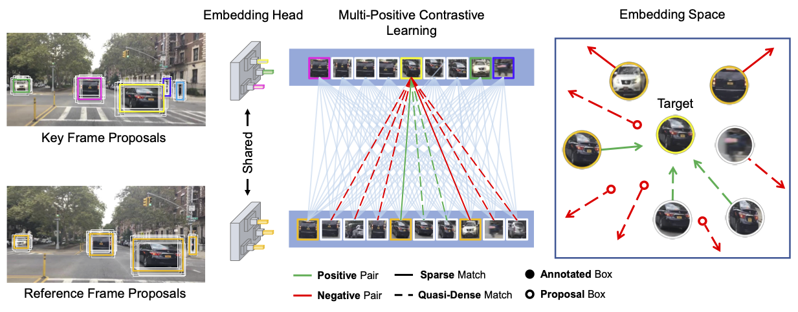

# [TPAMI 2023] QDTrack: Quasi-Dense Similarity Learning for Appearance-Only Multiple Object Tracking
This is the official implementation of our paper **"QDTrack: Quasi-Dense Similarity Learning for Appearance-Only Multiple Object Tracking"**.

[Tobias Fischer*](https://tobiasfshr.github.io/), [Thomas E Huang*](https://www.thomasehuang.com/), [Jiangmiao Pang*](https://scholar.google.com/citations?user=ssSfKpAAAAAJ), [Linlu Qiu](https://linlu-qiu.github.io/), [Haofeng Chen](https://www.haofeng.io/), Qi Li, [Trevor Darrell](https://people.eecs.berkeley.edu/~trevor/), [Fisher Yu](https://www.yf.io/)

[[Paper](https://arxiv.org/abs/2210.06984)]



## Abstract
Similarity learning has been recognized as a crucial step for object tracking. However, existing multiple object tracking methods only use sparse ground truth matching as the training objective, while ignoring the majority of the informative regions in images. In this paper, we present Quasi-Dense Similarity Learning, which densely samples hundreds of object regions on a pair of images for contrastive learning. We combine this similarity learning with multiple existing object detectors to build Quasi-Dense Tracking (QDTrack), which does not require displacement regression or motion priors. We find that the resulting distinctive feature space admits a simple nearest neighbor search at inference time for object association. In addition, we show that our similarity learning scheme is not limited to video data, but can learn effective instance similarity even from static input, enabling a competitive tracking performance without training on videos or using tracking supervision. We conduct extensive experiments on a wide variety of popular MOT benchmarks. We find that, despite its simplicity, QDTrack rivals the performance of state-of-the-art tracking methods on all benchmarks and sets a new state-of-the-art on the large-scale BDD100K MOT benchmark, while introducing negligible computational overhead to the detector.

## Model Zoo

| Detector  | Base Network | Strong Augs. | mMOTA-val | mIDF1-val | ID Sw.-val | Config | Weights | Preds | Visuals |
| :-: | :-: | :-: | :-: | :-: | :-: | :-: | :-: | :-: | :-: |
| Faster R-CNN | R-50-FPN | ✓ | 37.7 | 52.7 | 7257| [config](./qdtrack/qdtrack_frcnn_r50_fpn_augs_1x_bdd100k.py) | [model]() | [preds]() | [visuals]() |
| YOLOX-x | CSPNet | ✓ | 42.3 | 55.1 | 9164 | [config](./qdtrack/qdtrack_yolox_x_50e_bdd100k.py) | [model]() | [preds]() | [visuals]() |

## Getting Started

### Train
```bash
# R50
python -m vis4d.pl fit --config vis4d/zoo/qdtrack/qdtrack_frcnn_r50_fpn_augs_1x_bdd100k.py --gpus 8

# YOLOX
python -m vis4d.pl fit --config vis4d/zoo/qdtrack/qdtrack_yolox_x_50e_bdd100k.py --gpus 8
```

### Inference
```bash
# R50
python -m vis4d.pl test --config vis4d/zoo/qdtrack/qdtrack_frcnn_r50_fpn_augs_1x_bdd100k.py --ckpt ${checkpoint_path} --gpus ${num_gpus}

# YOLOX
python -m vis4d.pl test --config vis4d/zoo/qdtrack/qdtrack_yolox_x_50e_bdd100k.py --ckpt ${checkpoint_path} --gpus ${num_gpus}
```

## Citation
```
@article{fischer2023qdtrack,
  title={Qdtrack: Quasi-dense similarity learning for appearance-only multiple object tracking},
  author={Fischer, Tobias and Huang, Thomas E and Pang, Jiangmiao and Qiu, Linlu and Chen, Haofeng and Darrell, Trevor and Yu, Fisher},
  journal={IEEE Transactions on Pattern Analysis and Machine Intelligence},
  year={2023},
  publisher={IEEE}
}
```
